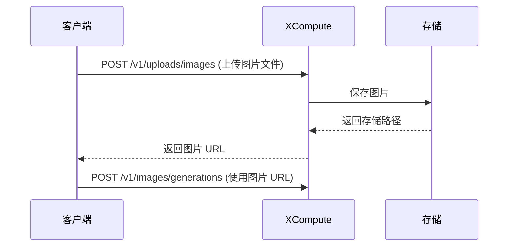

<Note>
  **文档 Playground 不支持文件上传**：请使用下方的 cURL、Python 或 JavaScript 代码示例进行测试。
</Note>

<Warning>
  **重要变更：** 为了更好的性能和成本控制，我们不再支持在生成接口中直接传入 base64 图片数据。请使用本接口上传图片，获取 URL 后再调用生成接口。
</Warning>

## 为什么需要先上传图片？

1. **性能优化** - base64 编码会使数据膨胀 33%，先上传可显著减少请求体大小
2. **复用图片** - 上传一次，URL 可多次使用，无需重复传输

## 使用流程



<RequestExample>
  ```bash cURL theme={null}
  curl --request POST \
    --url https://XCompute.us/v1/uploads/images \
    --header 'Authorization: Bearer <token>' \
    --form 'file=@/path/to/your/image.jpg'
  ```

  ```python Python theme={null}
  import requests

  # 上传图片
  with open('image.jpg', 'rb') as f:
      response = requests.post(
          "https://XCompute.us/v1/uploads/images",
          headers={
              "Authorization": "Bearer <token>"
          },
          files={
              "file": f
          }
      )

  result = response.json()
  image_url = result['url']
  print(f"图片 URL: {image_url}")

  # 使用上传的图片进行生成
  response = requests.post(
      "https://XCompute.us/v1/images/generations",
      headers={
          "Authorization": "Bearer <token>",
          "Content-Type": "application/json"
      },
      json={
          "model": "gemini-3-pro-image-preview",
          "prompt": "基于这张图片创作变体",
          "image_urls": [{"url": image_url}]
      }
  )
  ```

  ```javascript JavaScript theme={null}
  // 上传图片
  const formData = new FormData();
  formData.append('file', fileInput.files[0]);

  const uploadResponse = await fetch('https://XCompute.us/v1/uploads/images', {
    method: 'POST',
    headers: {
      'Authorization': 'Bearer <token>'
    },
    body: formData
  });

  const uploadResult = await uploadResponse.json();
  const imageUrl = uploadResult.url;
  console.log(`图片 URL: ${imageUrl}`);

  // 使用上传的图片进行生成
  const genResponse = await fetch('https://XCompute.us/v1/images/generations', {
    method: 'POST',
    headers: {
      'Authorization': 'Bearer <token>',
      'Content-Type': 'application/json'
    },
    body: JSON.stringify({
      model: 'gemini-3-pro-image-preview',
      prompt: '基于这张图片创作变体',
      image_urls: [{url: imageUrl}]
    })
  });
  ```
</RequestExample>

<ResponseExample>
  ```json 200 theme={null}
  {
    "url": "https://upload.apimart.ai/f/image/9990000123456-a1b2c3d4-photo.jpg",
    "filename": "photo.jpg",
    "content_type": "image/jpeg",
    "bytes": 235680,
    "created_at": 1743436800
  }
  ```

  ```json 400 - 缺少文件字段 theme={null}
  {
    "error": {
      "message": "missing or invalid file field: http: no such file",
      "type": "invalid_request_error"
    }
  }
  ```

  ```json 400 - 不支持的格式 theme={null}
  {
    "error": {
      "message": "unsupported image type: application/pdf, allowed: jpeg, png, gif, webp",
      "type": "invalid_request_error"
    }
  }
  ```

  ```json 413 - 文件过大 theme={null}
  {
    "error": {
      "message": "file size 25165824 exceeds maximum 20971520 bytes",
      "type": "invalid_request_error"
    }
  }
  ```

  ```json 429 - 请求频率限制 theme={null}
  {
    "error": {
      "code": 429,
      "message": "Rate limit exceeded. Please try again later",
      "type": "rate_limit_error"
    }
  }
  ```

  ```json 500 - 上传失败 theme={null}
  {
    "error": {
      "message": "failed to upload image",
      "type": "server_error"
    }
  }
  ```
</ResponseExample>

## Authorizations

<ParamField header="Authorization" type="string" required>
  所有接口均需要使用Bearer Token进行认证

  获取 API Key：

  访问 [API Key 管理页面](https://XCompute.us/console/token) 获取您的 API Key

  使用时在请求头中添加：

  ```
  Authorization: Bearer YOUR_API_KEY
  ```
</ParamField>

## Body

<ParamField body="file" type="file" required>
  图片文件

  支持格式：JPEG (.jpg, .jpeg)、PNG (.png)、WebP (.webp)、GIF (.gif)

  最大文件大小：20MB
</ParamField>

## Response

<ResponseField name="url" type="string">
  图片的公开访问 URL，可直接用于生成接口（72 小时有效）
</ResponseField>

<ResponseField name="filename" type="string">
  原始文件名
</ResponseField>

<ResponseField name="content_type" type="string">
  检测到的 MIME 类型，如 `image/jpeg`
</ResponseField>

<ResponseField name="bytes" type="integer">
  文件大小（字节）
</ResponseField>

<ResponseField name="created_at" type="integer">
  上传时间的 Unix 时间戳（秒）
</ResponseField>

## 完整示例：图生图工作流

```python Python theme={null}
import requests
import time

API_KEY = "your-XCompute-key"
BASE_URL = "https://XCompute.us"

# 第一步：上传参考图片
def upload_image(file_path):
    with open(file_path, 'rb') as f:
        response = requests.post(
            f"{BASE_URL}/v1/uploads/images",
            headers={"Authorization": f"Bearer {API_KEY}"},
            files={"file": f}
        )
    return response.json()['url']

# 第二步：创建生成任务
def create_generation(image_url, prompt):
    response = requests.post(
        f"{BASE_URL}/v1/images/generations",
        headers={
            "Authorization": f"Bearer {API_KEY}",
            "Content-Type": "application/json"
        },
        json={
            "model": "gemini-3-pro-image-preview",
            "prompt": prompt,
            "image_urls": [{"url": image_url}],
            "size": "16:9"
        }
    )
    return response.json()['id']

# 第三步：轮询任务状态
def wait_for_result(task_id):
    while True:
        response = requests.get(
            f"{BASE_URL}/v1/images/generations/{task_id}",
            headers={"Authorization": f"Bearer {API_KEY}"}
        )
        result = response.json()

        if result['status'] == 'completed':
            return result['url']
        elif result['status'] == 'failed':
            raise Exception(f"生成失败: {result.get('fail_reason')}")

        time.sleep(2)

# 执行工作流
image_url = upload_image("reference.jpg")
print(f"图片已上传: {image_url}")

task_id = create_generation(image_url, "将这张照片转换为吉卜力动画风格")
print(f"任务已创建: {task_id}")

result_url = wait_for_result(task_id)
print(f"生成完成: {result_url}")
```

